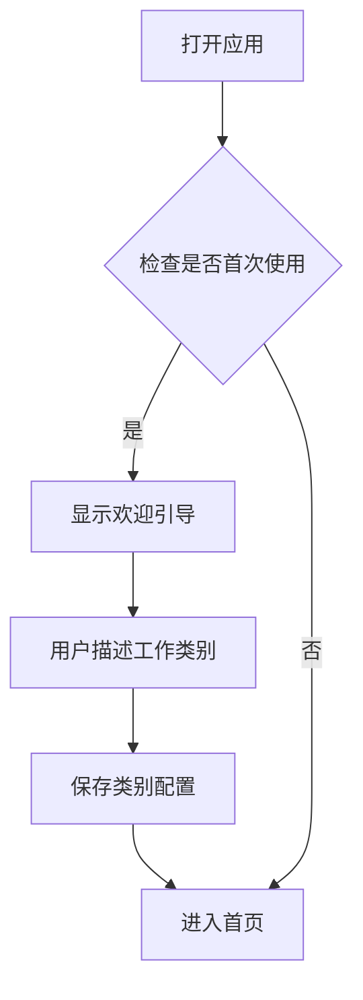
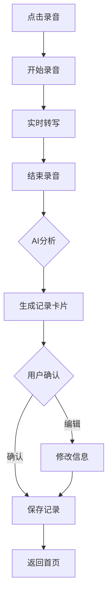
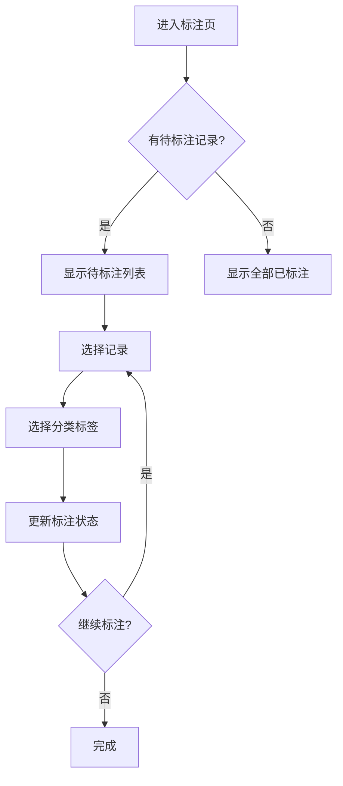

# 智能工时统计工具 - 产品设计文档

## 1. 产品概述

一款通用型语音输入工作耗时统计工具，通过自然语言交互让AI自动理解每位用户的工作结构，实现"说话即记录、智能即分类"的轻量化工作追踪体验。

## 2. 页面清单

| 页面名称 | 路由 | 核心功能 |
|---------|------|----------|
| 首页/录音页 | / | 语音录制、转写、生成记录 |
| 记录列表页 | /records | 历史记录浏览、筛选、搜索 |
| 标注页 | /annotation | 批量分类标注 |
| 工作台页 | /workbench | 统计图表展示 |
| 设置页 | /settings | 类别管理、数据导入导出 |

## 3. 页面设计详情

### 3.1 首页/录音页

**设计风格**：极简专注，强调核心录音功能

**布局结构**：
```
┌────────────────────────────────────┐
│ 顶部导航栏（标题 + 设置入口）        │
├────────────────────────────────────┤
│                                    │
│        ┌──────────────────┐        │
│        │                  │        │
│        │    录音按钮      │        │
│        │   （大圆形）      │        │
│        │                  │        │
│        └──────────────────┘        │
│                                    │
│     录音时长：00:00:00              │
│                                    │
│  ┌────────────────────────────┐    │
│  │    实时转写文本区域         │    │
│  │    （等待语音输入...）       │    │
│  └────────────────────────────┘    │
│                                    │
│  ┌────────────────────────────┐    │
│  │      生成记录卡片           │    │
│  │  时间：09:00 - 11:00       │    │
│  │  内容：清洁机器人调试       │    │
│  │  分类：[待标注]             │    │
│  └────────────────────────────┘    │
│                                    │
│  [ 确认 ]  [ 编辑 ]  [ 取消 ]       │
│                                    │
├────────────────────────────────────┤
│ 底部导航栏                          │
│ [首页] [记录] [标注] [工作台] [设置] │
└────────────────────────────────────┘
```

**UI元素**：
- **录音按钮**：大圆形，直径120px，渐变背景（主色#6366f1到#8b5cf6）
- **状态动画**：录音时显示脉冲动画 + 麦克风图标跳动
- **转写区域**：圆角卡片，浅灰背景，动态打字效果
- **记录卡片**：白底卡片，轻阴影，显示提取的信息

**交互状态**：
| 状态 | 视觉表现 |
|------|----------|
| 空闲 | 静态麦克风图标 |
| 录音中 | 脉冲动画 + 波形 + 计时 |
| 处理中 | 加载动画 + "AI分析中..." |
| 已生成 | 显示记录卡片 + 操作按钮 |

### 3.2 记录列表页

**布局结构**：
```
┌────────────────────────────────────┐
│ 返回 + 记录列表 + 搜索图标          │
├────────────────────────────────────┤
│ [全部] [今天] [本周] [本月]         │
├────────────────────────────────────┤
│ ▼ 2024-01-15                       │
│  ┌────────────────────────────┐    │
│  │ 09:00-11:00 | 清洁机器人    │    │
│  │ 设备调试工作...            │    │
│  │                    [编辑]  │    │
│  └────────────────────────────┘    │
│  ┌────────────────────────────┐    │
│  │ 14:00-15:30 | 传统保洁      │    │
│  │ 地面清洁...                │    │
│  │                    [编辑]  │    │
│  └────────────────────────────┘    │
├────────────────────────────────────┤
│ ▼ 2024-01-14                       │
│  ...                                │
└────────────────────────────────────┘
```

**UI元素**：
- **筛选标签**：横向滚动胶囊按钮
- **日期分组**：折叠式分组，日期 + 记录数
- **记录卡片**：左侧时间轴 + 右侧内容
- **快捷操作**：滑动显示编辑/删除

### 3.3 标注页

**布局结构**：
```
┌────────────────────────────────────┐
│ 返回 + 标注工作台      [批量标注]   │
├────────────────────────────────────┤
│ 标注进度：12/50 条 已完成          │
│ ████████░░░░░░░░░░░░░░░ 24%       │
├────────────────────────────────────┤
│ 分类标签区                         │
│ ┌─────────┐ ┌─────────┐ ┌─────────┐│
│ │清洁机器人│ │传统保洁 │ │  无人机 ││
│ │  12条   │ │   8条   │ │   5条   ││
│ └─────────┘ └─────────┘ └─────────┘│
├────────────────────────────────────┤
│ 待标注记录                         │
│ ┌────────────────────────────┐    │
│ │ ☐ 09:00-11:00 清洁机器人调试│    │
│ │   设备参数调整和测试        │    │
│ └────────────────────────────┘    │
│ ┌────────────────────────────┐    │
│ │ ☐ 14:00-15:30 场地勘察     │    │
│ │   无人机飞行区域评估        │    │
│ └────────────────────────────┘    │
└────────────────────────────────────┘
```

**UI元素**：
- **进度条**：渐变填充动画
- **分类卡片**：大按钮，点击/拖拽记录到分类
- **记录复选**：批量选择支持

### 3.4 工作台页

**布局结构**：
```
┌────────────────────────────────────┐
│ 工作台               [日] [周] [月] │
├────────────────────────────────────┤
│ 2024年1月15日 - 1月21日 ▼          │
├────────────────────────────────────┤
│ ┌────────────┐ ┌────────────┐     │
│ │  总耗时    │ │  记录数    │     │
│ │   32.5h    │ │    28条    │     │
│ └────────────┘ └────────────┘     │
├────────────────────────────────────┤
│     工作类别耗时分布（饼图）         │
│        ┌──────────┐               │
│       /            \               │
│      │  清洁机器人  │              │
│      │    45%      │               │
│       \            /               │
│        └──────────┘                │
│      传统保洁    无人机            │
├────────────────────────────────────┤
│     耗时趋势（折线图）              │
│     ~~~/\~~~/\~~~                  │
│                                    │
├────────────────────────────────────┤
│ 工作项明细                          │
│ ▼ 清洁机器人（14.6h）               │
│   · 设备调试  5.2h                 │
│   · 场地勘察  4.5h                 │
│   · 客户演示  3.8h                 │
│ ▼ 传统保洁（12.8h）                 │
│   · 日常清洁  8.2h                 │
│   · 设备维护  4.6h                 │
└────────────────────────────────────┘
```

**UI元素**：
- **统计卡片**：数字突出显示
- **饼图**：环形图，悬停显示详情
- **折线图**：平滑曲线，数据点标记
- **明细列表**：可折叠分组

### 3.5 设置页

**布局结构**：
```
┌────────────────────────────────────┐
│ 返回 + 设置                         │
├────────────────────────────────────┤
│ 工作类别管理                        │
│ ┌────────────────────────────┐    │
│ │ + 添加新类别                │    │
│ └────────────────────────────┘    │
│ ┌────────────────────────────┐    │
│ │ ✎ 清洁机器人        [删除] │    │
│ │   关键词：机器人, 调试...   │    │
│ └────────────────────────────┘    │
│ ┌────────────────────────────┐    │
│ │ ✎ 传统保洁          [删除] │    │
│ │   关键词：清洁, 拖地...    │    │
│ └────────────────────────────┘    │
├────────────────────────────────────┤
│ 数据管理                            │
│ ┌────────────────────────────┐    │
│ │ 导出数据                    │    │
│ └────────────────────────────┘    │
│ ┌────────────────────────────┐    │
│ │ 导入数据                    │    │
│ └────────────────────────────┘    │
│ ┌────────────────────────────┐    │
│ │ 清空所有数据                │    │
│ └────────────────────────────┘    │
├────────────────────────────────────┤
│ 关于                              │
│ 版本 1.0.0                        │
└────────────────────────────────────┘
```

## 4. 设计规范

### 4.1 色彩系统

```css
:root {
  /* 主色调 */
  --primary: #6366f1;
  --primary-light: #818cf8;
  --primary-dark: #4f46e5;

  /* 辅助色 */
  --secondary: #8b5cf6;
  --success: #10b981;
  --warning: #f59e0b;
  --error: #ef4444;

  /* 中性色 */
  --bg-primary: #ffffff;
  --bg-secondary: #f8fafc;
  --bg-tertiary: #f1f5f9;
  --text-primary: #1e293b;
  --text-secondary: #64748b;
  --text-tertiary: #94a3b8;
  --border: #e2e8f0;

  /* 阴影 */
  --shadow-sm: 0 1px 2px rgba(0, 0, 0, 0.05);
  --shadow-md: 0 4px 6px -1px rgba(0, 0, 0, 0.1);
  --shadow-lg: 0 10px 15px -3px rgba(0, 0, 0, 0.1);
}
```

### 4.2 字体系统

- **主字体**：`"Inter", "PingFang SC", "Microsoft YaHei", sans-serif`
- **数字字体**：`"JetBrains Mono", monospace`
- **字号层级**：
  - 标题：24px / 700
  - 副标题：18px / 600
  - 正文：16px / 400
  - 辅助：14px / 400
  - 标签：12px / 500

### 4.3 间距系统

- 基础单位：4px
- 常用间距：8px, 12px, 16px, 24px, 32px, 48px
- 页面边距：16px（移动端）/ 24px（桌面端）
- 卡片间距：12px
- 组件内间距：16px

### 4.4 圆角系统

- 按钮：8px
- 卡片：12px
- 输入框：8px
- 标签/徽章：9999px（药丸形）

### 4.5 动效规范

- **过渡时长**：150ms（快）/ 300ms（标准）
- **缓动函数**：`cubic-bezier(0.4, 0, 0.2, 1)`
- **录音脉冲**：1.5s 无限循环
- **列表进入**：stagger 50ms，fade + slide-up

## 5. 响应式设计

- **移动端优先**（375px - 768px）
- **平板适配**（768px - 1024px）
- **桌面适配**（1024px+）
- 底部导航栏固定
- 内容区域可滚动

## 6. 组件清单

| 组件名 | 用途 | 状态 |
|--------|------|------|
| RecordButton | 录音按钮 | idle/recording/processing |
| AudioWaveform | 音频波形 | active/inactive |
| TranscriptView | 转写文本 | empty/typing/done |
| RecordCard | 记录卡片 | pending/confirmed |
| CategoryTag | 分类标签 | default/selected/hover |
| StatCard | 统计卡片 | - |
| PieChart | 饼图 | - |
| LineChart | 折线图 | - |
| DatePicker | 日期选择器 | - |
| BottomNav | 底部导航 | - |
| HeaderBar | 顶部导航 | - |

## 7. 用户流程图

### 首次使用流程


### 日常记录流程


### 标注流程

