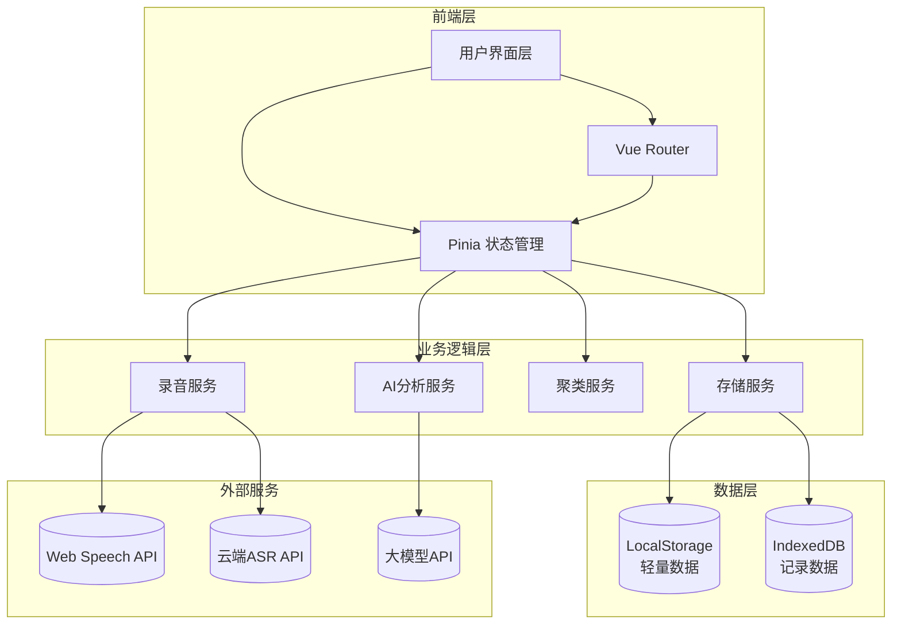

# 智能工时统计工具 - 技术架构文档

## 1. 技术栈概览

- **前端框架**：Vue 3 + TypeScript
- **构建工具**：Vite
- **UI框架**：Tailwind CSS
- **状态管理**：Pinia
- **路由**：Vue Router 4
- **图表**：ECharts + vue-echarts
- **工具库**：VueUse Core
- **存储**：LocalStorage + IndexedDB
- **语音API**：Web Speech API（浏览器原生）+ 云端ASR API（可选）
- **AI能力**：云端大模型API（可选集成）

## 2. 系统架构图



## 3. 目录结构

```
src/
├── assets/              # 静态资源
├── components/          # 公共组件
│   ├── ui/             # UI基础组件
│   ├── record/         # 录音相关组件
│   ├── statistics/     # 统计图表组件
│   └── common/         # 通用组件
├── composables/        # 组合式函数
│   ├── useAudioRecorder.ts
│   ├── useSpeechRecognition.ts
│   ├── useLocalStorage.ts
│   └── useAIAnalysis.ts
├── pages/              # 页面组件
│   ├── HomePage.vue    # 首页/录音页
│   ├── RecordList.vue  # 记录列表页
│   ├── Annotation.vue  # 标注页
│   ├── Workbench.vue   # 工作台页
│   └── Settings.vue    # 设置页
├── router/             # 路由配置
├── stores/             # Pinia状态管理
│   ├── recordStore.ts
│   ├── categoryStore.ts
│   ├── clusterStore.ts
│   └── userStore.ts
├── types/              # TypeScript类型定义
│   └── index.ts
├── utils/              # 工具函数
│   ├── storage.ts
│   ├── time.ts
│   └── ai.ts
├── App.vue
└── main.ts
```

## 4. 核心数据模型

### 4.1 工作记录 (WorkRecord)

```typescript
interface WorkRecord {
  id: string;
  startTime: string;      // ISO 8601 格式
  endTime: string;        // ISO 8601 格式
  duration: number;       // 分钟
  rawText: string;        // 原始语音转写文本
  summary: string;        // AI提取的工作摘要
  categoryId: string | null;     // 所属类别ID
  clusterId: string | null;      // 所属聚类ID
  confidence: number;     // AI分类置信度 0-1
  annotationStatus: 'pending' | 'confirmed' | 'rejected';
  createdAt: string;
  updatedAt: string;
}
```

### 4.2 工作类别 (WorkCategory)

```typescript
interface WorkCategory {
  id: string;
  name: string;           // 用户自定义名称
  description: string;    // 类别描述
  keywords: string[];     // AI提取关键词
  usageCount: number;     // 被使用次数
  createdAt: string;
}
```

### 4.3 聚类结果 (Cluster)

```typescript
interface Cluster {
  id: string;
  categoryId: string;
  name: string;           // 聚类名称
  recordIds: string[];
  totalDuration: number;
  createdAt: string;
  updatedAt: string;
}
```

### 4.4 用户配置 (UserConfig)

```typescript
interface UserConfig {
  hasCompletedOnboarding: boolean;
  categories: WorkCategory[];
  firstUseDate: string;
  totalRecords: number;
  annotationProgress: {
    total: number;
    annotated: number;
  };
}
```

## 5. 路由定义

| 路由 | 页面 | 功能描述 |
|------|------|----------|
| / | HomePage | 首页/录音页 |
| /records | RecordList | 记录列表页 |
| /annotation | Annotation | 标注页 |
| /workbench | Workbench | 工作台统计页 |
| /settings | Settings | 设置页 |

## 6. 关键实现方案

### 6.1 语音录制

使用 Web Audio API + MediaRecorder 实现录音：

```typescript
// 核心流程
navigator.mediaDevices.getUserMedia({ audio: true })
  .then(stream => {
    const mediaRecorder = new MediaRecorder(stream);
    // 录音数据收集
    mediaRecorder.ondataavailable = (e) => {
      audioChunks.push(e.data);
    };
    // 录音完成
    mediaRecorder.onstop = () => {
      const audioBlob = new Blob(audioChunks, { type: 'audio/webm' });
      // 转为 Base64 发送给后端或使用 Web Speech API
    };
  });
```

### 6.2 语音识别

方案一：使用 Web Speech API（浏览器原生，无需API Key）

```typescript
const recognition = new webkitSpeechRecognition();
recognition.continuous = true;
recognition.interimResults = true;
recognition.lang = 'zh-CN';
```

方案二：集成云端 ASR API（如需更高准确率）

### 6.3 AI 分析服务

记录生成后，调用大模型API提取结构化信息：

```typescript
interface AIAnalysisResult {
  startTime: string;
  endTime: string;
  duration: number;
  summary: string;
  suggestedCategory: string;
  confidence: number;
}

// 调用示例
async function analyzeRecord(text: string, categories: WorkCategory[]): Promise<AIAnalysisResult> {
  // 构造 prompt，注入用户的工作类别信息
  // 调用大模型API
  // 返回结构化结果
}
```

### 6.4 本地存储策略

```typescript
// 使用 LocalStorage 存储轻量配置
const CONFIG_KEY = 'worktime_config';
const CATEGORIES_KEY = 'worktime_categories';

// 使用 IndexedDB 存储大量记录
const DB_NAME = 'WorkTimeDB';
const STORE_RECORDS = 'records';
const STORE_CLUSTERS = 'clusters';
```

### 6.5 聚类算法

基于内容的语义聚类：

```typescript
// 简化版聚类逻辑
function clustering(records: WorkRecord[], categories: WorkCategory[]): Cluster[] {
  // 1. 按类别分组记录
  // 2. 在每个类别内，基于关键词/语义相似度进一步聚类
  // 3. 生成聚类标签
  // 4. 返回聚类结果
}
```

## 7. 页面详细设计

### 7.1 首页/录音页 (HomePage)

**核心功能**：
- 大型录音按钮（点击开始/结束录音）
- 实时语音波形显示
- 实时转写文本显示
- 生成记录卡片展示
- 记录确认/编辑操作

**组件结构**：
```
HomePage
├── RecordButton      # 录音按钮组件
├── AudioWaveform     # 音频波形可视化
├── TranscriptView    # 转写文本显示
├── RecordCard        # 记录卡片（时间、内容、分类）
└── ActionButtons     # 确认/编辑/取消按钮
```

### 7.2 记录列表页 (RecordList)

**核心功能**：
- 按日期分组展示记录
- 支持日期筛选
- 支持关键词搜索
- 支持分类筛选
- 快速标注入口

### 7.3 标注页 (Annotation)

**核心功能**：
- 待标注记录列表
- 分类标签区（拖拽或点击标注）
- 批量标注功能
- 标注进度显示
- AI推荐显示

### 7.4 工作台页 (Workbench)

**核心功能**：
- 时间范围选择器
- 分类耗时饼图
- 耗时趋势折线图
- 工作项明细列表
- 聚类结果卡片

### 7.5 设置页 (Settings)

**核心功能**：
- 管理工作类别（增删改）
- 首次使用引导入口
- 数据导出/导入
- 清空数据

## 8. 状态管理设计

### 8.1 Pinia Store 结构

```typescript
// userStore - 用户配置
useUserStore: {
  config: UserConfig,
  hasCompletedOnboarding: boolean,
  setOnboardingComplete(): void,
  addCategory(): void,
  updateCategory(): void,
  deleteCategory(): void
}

// recordStore - 记录管理
useRecordStore: {
  records: WorkRecord[],
  currentRecord: WorkRecord | null,
  addRecord(): void,
  updateRecord(): void,
  deleteRecord(): void,
  getRecordsByDate(): Record<string, WorkRecord[]>,
  getRecordsByCategory(): Map<string, WorkRecord[]>
}

// clusterStore - 聚类管理
useClusterStore: {
  clusters: Cluster[],
  runClustering(): void,
  updateCluster(): void,
  getClusterStats(): ClusterStats
}
```

## 9. 性能优化策略

1. **录音转写**：使用 Web Speech API 实现实时转写，无需等待录音结束
2. **列表渲染**：使用虚拟滚动处理大量记录
3. **图表**：按需加载 ECharts 组件
4. **存储**：IndexedDB 异步操作，不阻塞UI
5. **AI调用**：批量处理，缓存分析结果

## 10. 兼容性考虑

- 主要目标浏览器：Chrome 90+, Edge 90+, Safari 15+
- 需要 HTTPS 环境才能使用麦克风（localhost 除外）
- Web Speech API 兼容性：Chrome 完全支持，Safari 部分支持
- 后备方案：提供手动输入模式作为语音不可用时的备选
